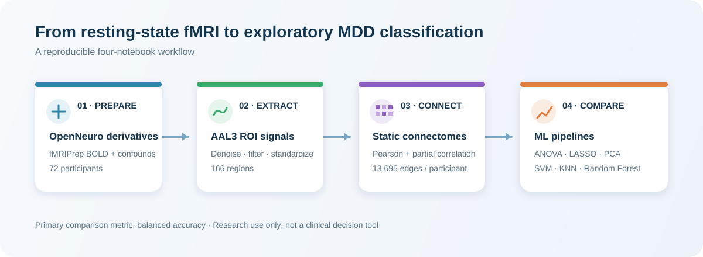
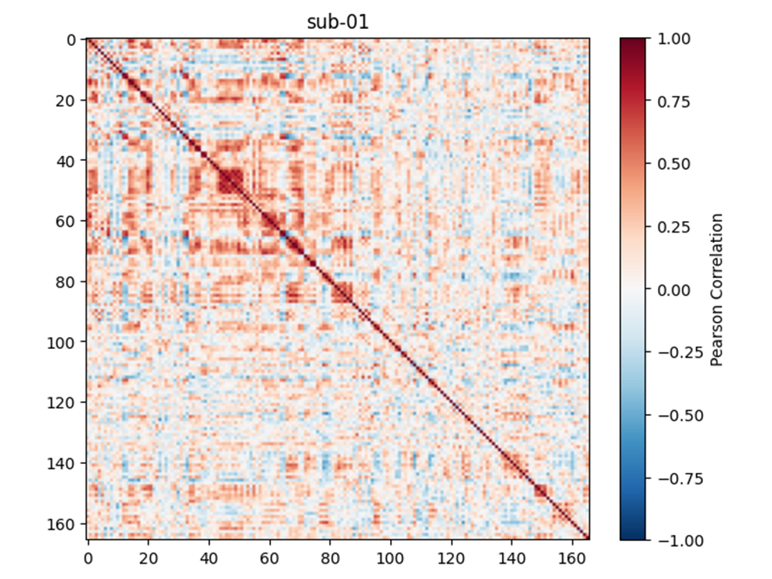
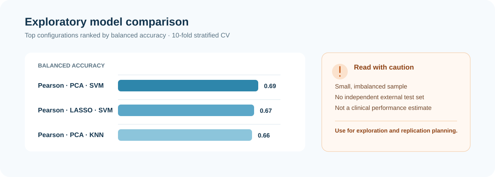

# fMRI-Connectome-MDD

**An end-to-end, Google Colab–ready workflow for resting-state fMRI functional-connectivity analysis and exploratory major depressive disorder (MDD) classification.**

The project uses fMRIPrep derivatives of the OpenNeuro **[ds002748](https://openneuro.org/datasets/ds002748)** dataset to extract AAL3 ROI time series, estimate static functional connectivity, derive connectome features, and compare classical machine-learning pipelines.

<p align="center">
  
</p>


## Contents

- [What this project does](#what-this-project-does)
- [Dataset and labels](#dataset-and-labels)
- [Workflow](#workflow)
- [Run the notebooks](#run-the-notebooks)
- [Repository layout](#repository-layout)
- [Methods at a glance](#methods-at-a-glance)
- [Included results](#included-results)
- [Outputs](#outputs)
- [Interpretation and limitations](#interpretation-and-limitations)
- [Citation and data attribution](#citation-and-data-attribution)

## What this project does

1. Downloads preprocessed resting-state BOLD images and confounds from OpenNeuro.
2. Regresses selected confounds and extracts denoised AAL3 ROI time series.
3. Computes subject-level Pearson and partial-correlation connectivity matrices.
4. Vectorizes each matrix's upper triangle into a connectome feature vector.
5. Explores ANOVA, LASSO, and PCA feature representations.
6. Compares SVM, K-nearest-neighbors (KNN), and random-forest classifiers using stratified cross-validation and balanced accuracy.

## Dataset and labels

| Item | Value |
| --- | --- |
| Source dataset | OpenNeuro [ds002748](https://openneuro.org/datasets/ds002748) |
| Imaging inputs | fMRIPrep preprocessed resting-state BOLD images and confound time series |
| Participants | 72 total |
| Groups | 51 MDD; 21 healthy controls (HC) |
| Label coding | `0 = control`, `1 = depr` |
| Parcellation | AAL3; 166 active ROIs |
| Connectivity features | 13,695 unique ROI-pair edges per participant (`166 × 165 / 2`) |

The first notebook downloads the required derivative files directly from the public OpenNeuro S3 bucket. No manual dataset download is needed in Colab.

## Workflow

```text
OpenNeuro ds002748 fMRIPrep derivatives
             │
             ▼
[1] Confound regression + filtering + AAL3 time-series extraction
             │  72 subject-level time-series arrays + ROI metadata
             ▼
[2] Pearson / partial functional connectivity
             │  166 × 166 matrices → 13,695-edge feature vectors
             ▼
[3] Exploratory feature analysis
             │  ANOVA | LASSO | PCA
             ▼
[4] Classification comparison
    2 connectivity types × 4 feature representations × 3 classifiers
    = 24 evaluated configurations
```

## Run the notebooks

### Fastest path: Google Colab

Run the notebooks in order. Each notebook installs its own runtime dependencies and either generates or downloads the inputs it needs.

| Step | Notebook | Purpose | Open in Colab |
| --- | --- | --- | --- |
| 1 | `ds002748_Notebook1.ipynb` | Download derivatives and extract AAL3 ROI time series | [Open](https://colab.research.google.com/github/negareri/fMRI-Connectome-MDD/blob/main/notebooks/ds002748_Notebook1.ipynb) |
| 2 | `ds002748_Notebook2.ipynb` | Estimate Pearson and partial connectivity | [Open](https://colab.research.google.com/github/negareri/fMRI-Connectome-MDD/blob/main/notebooks/ds002748_Notebook2.ipynb) |
| 3 | `ds002748_Notebook3.ipynb` | Inspect labels; explore ANOVA, LASSO, and PCA | [Open](https://colab.research.google.com/github/negareri/fMRI-Connectome-MDD/blob/main/notebooks/ds002748_Notebook3.ipynb) |
| 4 | `ds002748_Notebook4.ipynb` | Tune and compare classification pipelines | [Open](https://colab.research.google.com/github/negareri/fMRI-Connectome-MDD/blob/main/notebooks/ds002748_Notebook4.ipynb) |

> **Tip:** Notebooks 2–4 can fetch the archived/intermediate repository outputs required for their respective stages.

### Local execution

Clone the repository and launch Jupyter:

```bash
git clone https://github.com/negareri/fMRI-Connectome-MDD.git
cd fMRI-Connectome-MDD
python -m venv .venv
source .venv/bin/activate          # Windows: .venv\Scripts\activate
pip install jupyter numpy pandas matplotlib seaborn scikit-learn nilearn awscli
jupyter notebook
```

The notebooks use Colab-oriented paths such as `/content` and shell commands such as `aws s3` and `wget`. For a local run, update those paths and ensure that `awscli`, `wget`, and a compatible Python scientific stack are available. Download volume and runtime depend on the environment.

## Repository layout

```text
.
├── notebooks/
│   ├── ds002748_Notebook1.ipynb   # Download, QC, denoising, ROI time series
│   ├── ds002748_Notebook2.ipynb   # Functional connectivity and vectors
│   ├── ds002748_Notebook3.ipynb   # Labels, ANOVA, LASSO, PCA exploration
│   └── ds002748_Notebook4.ipynb   # ML pipelines and comparison
├── outputs/
│   ├── notebook1/                  # Time-series archive and ROI metadata
│   ├── notebook2/                  # FC archives and X_pearson/X_partial arrays
│   ├── notebook3/                  # Participant labels and feature-analysis notes
│   └── notebook4/                  # Model-comparison notes
└── README.md
```

## Methods at a glance

### 1. ROI time-series extraction

- **Atlas:** AAL3, resampled to the functional image space with nearest-neighbor interpolation.
- **Nuisance regressors:** translations (`trans_x/y/z`), rotations (`rot_x/y/z`), CSF, and white matter from fMRIPrep confounds.
- **Temporal processing:** linear detrending, sample z-score standardization, and a 0.01–0.10 Hz band-pass filter.
- **TR:** 2.5 seconds, supplied to `NiftiLabelsMasker`.

### 2. Functional connectivity

For every participant, Notebook 2 estimates:

- **Pearson correlation** between all ROI time-series pairs.
- **Partial correlation**, using Nilearn's connectivity estimator.

Only the upper triangle (excluding the diagonal) is retained, yielding 13,695 features per connectivity type and participant.

#### Connectivity, visualized

The matrix is the complete pairwise connectivity representation for one participant: each cell is the correlation between two AAL3 regions. For interpretability, Notebook 3 maps selected edges back onto a circular connectome, where each colored segment is an ROI and each chord is a selected connection.

<table>
  <tr>
    <td width="50%" align="center"></td>
    <td width="50%" align="center"></td>
  </tr>
  <tr>
    <td align="center"><strong>All pairwise Pearson correlations</strong><br><sub>One 166 × 166 matrix per participant</sub></td>
    <td align="center"><strong>Selected connectome edges</strong><br><sub>Notebook 3 exploratory LASSO visualization</sub></td>
  </tr>
</table>


### 3. Feature representations

Classification evaluates four feature representations for each connectivity type:

- **Original:** all 13,695 edge features.
- **ANOVA:** univariate `SelectKBest(f_classif)` selection.
- **LASSO:** L1-regularized logistic-regression selection via `SelectFromModel`.
- **PCA:** principal components retaining a tuned fraction of variance.

Feature transformations are included inside the model pipelines used in Notebook 4.

### 4. Classification and metrics

- **Classifiers:** support vector machine (SVM), KNN, and random forest.
- **Validation:** shuffled 10-fold `StratifiedKFold`, with `random_state=42`.
- **Tuning:** `GridSearchCV`, optimized for **balanced accuracy**.
- **Reported metrics:** accuracy, balanced accuracy, sensitivity (MDD recall), specificity (HC recall), and F1-score.

Balanced accuracy is the primary comparison metric because MDD is the majority class (51/72); raw accuracy can be inflated by majority-class predictions.

## Included results

The repository includes precomputed feature matrices and a summary of the 24 configurations in [`outputs/notebook4/README.md`](outputs/notebook4/README.md).

<p align="center">
  
</p>


## Outputs

| Stage | Main artifacts |
| --- | --- |
| Notebook 1 | `AAL3_timeseries_all_subjects.zip`: per-subject `*_timeseries.npy` files plus `extraction_metadata.json` ROI-column mapping |
| Notebook 2 | Pearson/partial FC matrix archives; feature-vector archives; `X_pearson.npy` and `X_partial.npy` (`72 × 13,695`) |
| Notebook 3 | `participants_with_labels.csv`, feature-selection visualizations and PCA summaries |
| Notebook 4 | Performance tables and Pearson/partial model-comparison heatmaps |

See the README in each [`outputs/`](outputs) subdirectory for stage-specific output descriptions and figures.

## Interpretation and limitations

This repository is designed as an educational/research workflow, not as a deployable biomarker study.

- **Small, imbalanced sample:** 72 participants (51 MDD / 21 HC) and 13,695 edges create a high-dimensional, low-sample-size problem.
- **No independent external test set:** the reported values should be regarded as exploratory internal-validation results, not evidence of generalization.
- **Model-selection optimism:** hyperparameters are selected using cross-validation and the same dataset is subsequently used for reported cross-validated predictions. A future confirmatory analysis should use nested cross-validation and, ideally, a held-out external cohort.
- **Clinical heterogeneity and confounding:** diagnosis alone does not capture medication status, symptom severity, demographics, motion, site effects, or other potential confounders.
- **Feature findings are not biomarkers:** selected edges and coefficients are hypothesis-generating and require independent replication, appropriate statistical controls, and clinical validation.

## Citation and data attribution

If you use or adapt this work, please cite the repository and cite/acknowledge the source dataset according to the [OpenNeuro ds002748 dataset page](https://openneuro.org/datasets/ds002748).

Please also retain the attribution and terms associated with fMRIPrep, Nilearn, the AAL3 atlas, and all other resources used by the workflow.
