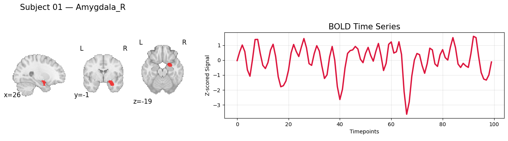
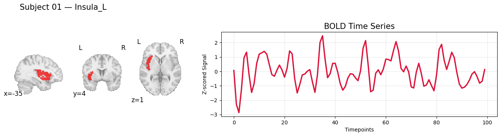

# Notebook 1 Outputs

```
├── AAL3_timeseries_all_subjects.zip
│   ├── *_timeseries.npy
│   │   └── Extracted ROI-level BOLD time-series for each participant
│   │
│   └── extraction_metadata.json
│       └── ROI-column mapping information for interpreting extracted signals
│
└── figs/
    ├── sub-01_amygdala_r.png
    └── sub-01_insula_l.png
```

## Example ROI Time-Series Visualizations

Example BOLD signals extracted from two AAL3 brain regions for `sub-01`.




