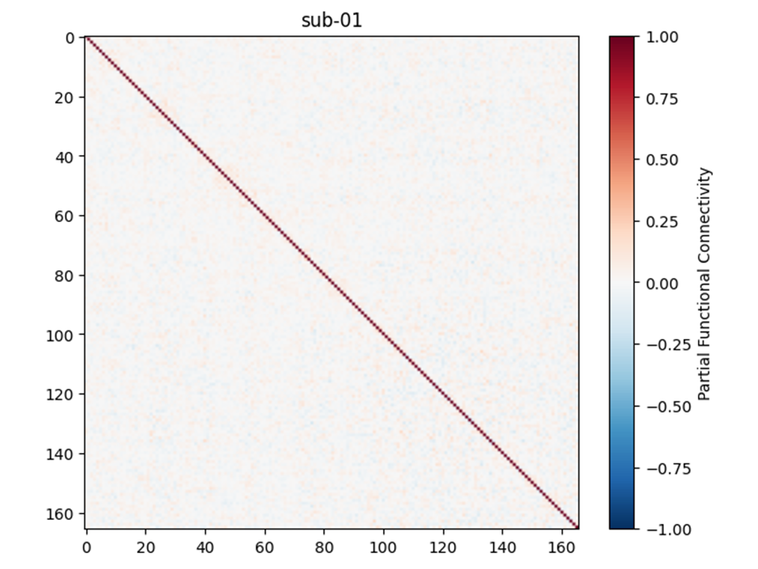

# Notebook 2 Outputs

```text
├── pearson_fc.zip
│   └── Pearson correlation matrices
│       (one connectivity matrix per participant)
│
├── partial_fc.zip
│   └── Partial correlation matrices
│       (one connectivity matrix per participant)
│
├── pearson_features.zip
│   └── Upper-triangular Pearson connectivity vectors
│       (one feature vector per participant)
│
├── partial_features.zip
│   └── Upper-triangular partial connectivity vectors
│       (one feature vector per participant)
│
├── X_pearson.npy
│   └── Combined Pearson feature matrix
│       (72 participants × 13,695 connectivity features)
│
├── X_partial.npy
│   └── Combined partial feature matrix
│       (72 participants × 13,695 connectivity features)
│
└── figs/
    ├── pearson_matrix_example.png
    └── partial_matrix_example.png


```

## Connectivity Matrices

The following examples show Pearson and partial connectivity matrices generated for participant **sub-01**.

| Pearson Connectivity Matrix | Partial Connectivity Matrix |
|:---:|:---:|
|  |  |
