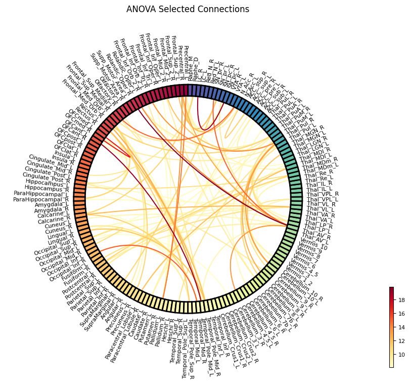
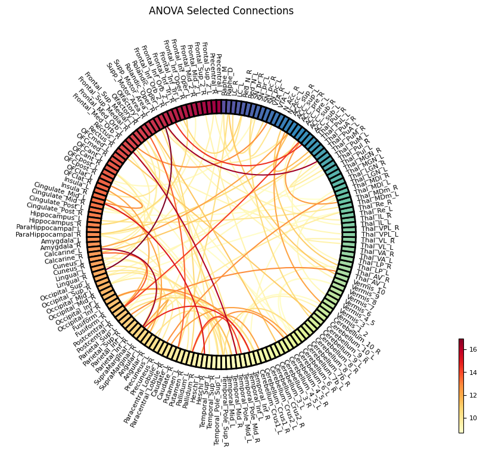
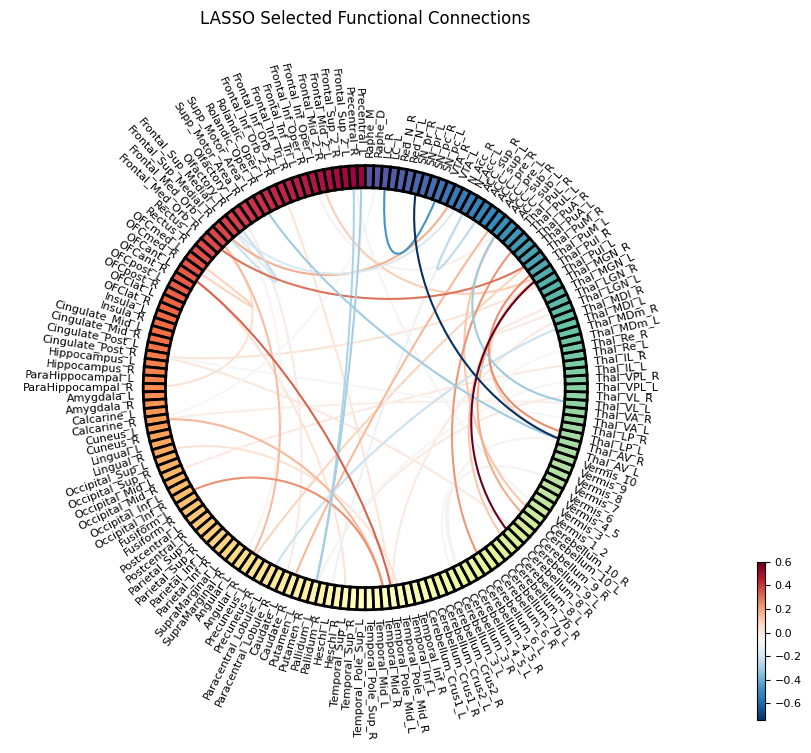
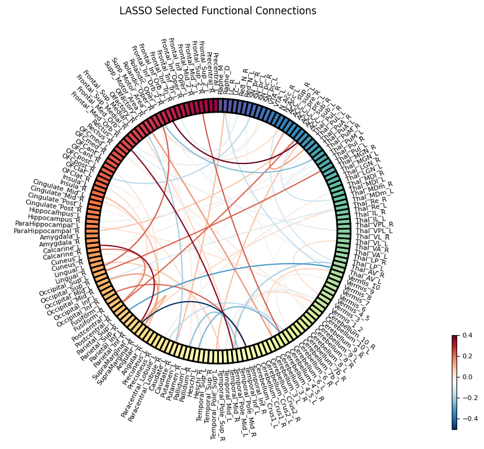
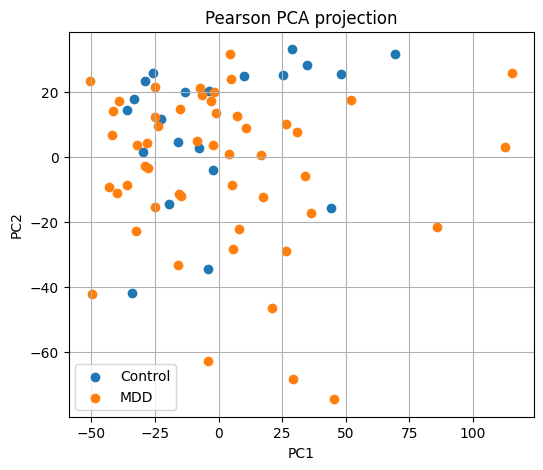
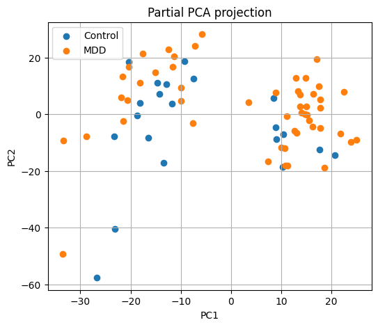

# Notebook 3 Outputs

```text
├── participants_with_labels.csv
│   └── Participant metadata with generated binary class labels
└── figs
    ├── ANOVA figures
    ├── LASSO figures
    └── PCA figures
```

## 1. Analysis of Variance (ANOVA / F-test)

| Pearson Connectivity ANOVA | Partial Connectivity ANOVA |
| :---: | :---: |
|  |  |

<table>
<tr>
<td valign="top">
  
### Pearson ANOVA (Top 5)

| Rank | ROI 1 | ROI 2 | F-score |
|:---:|:---|:---|:---:|
| **1** | Rolandic_Oper_R | Thal_AV_R | 19.83 |
| **2** | OFCant_L | Temporal_Pole_Mid_L | 19.13 |
| **3** | SN_pc_L | LC_R | 18.95 |
| **4** | OFCmed_L | OFCmed_R | 16.78 |
| **5** | Occipital_Inf_R | Temporal_Mid_R | 15.07 |

</td>

<td valign="top">

### Partial ANOVA (Top 5)

| Rank | ROI 1 | ROI 2 | F-score |
|:---:|:---|:---|:---:|
| **1** | Rolandic_Oper_L | Lingual_R | 16.96 |
| **2** | Calcarine_L | SupraMarginal_L | 16.42 |
| **3** | Rolandic_Oper_L | Thal_PuM_R | 16.37 |
| **4** | Frontal_Med_Orb_R | Temporal_Pole_Mid_L | 16.09 |
| **5** | Cingulate_Mid_L | Heschl_R | 15.06 |

</td>
</tr>
</table>

---

## 2. LASSO (L1-Regularized Logistic Regression)


| Pearson Connectivity LASSO | Partial Connectivity LASSO |
| :---: | :---: |
|  |  |

<table>
<tr>
<td valign="top">

#### A. Pearson LASSO (Top 5)

| Rank | ROI 1 | ROI 2 | Coefficient |
|:---:|:---|:---|:---:|
| **1** | Thal_AV_R | SN_pr_R | -0.74 |
| **2** | Cerebellum_8_R | Thal_PuI_R | 0.60 |
| **3** | SN_pc_L | LC_R | -0.47 |
| **4** | OFCant_L | Temporal_Pole_Mid_L | 0.33 |
| **5** | Thal_VL_L | ACC_sub_R | -0.31 |

</td>

<td valign="top">

#### B. Partial LASSO (Top 5)

| Rank | ROI 1 | ROI 2 | Coefficient |
|:---:|:---|:---|:---:|
| **1** | SupraMarginal_L | Temporal_Inf_R | -0.51 |
| **2** | Frontal_Inf_Orb_2_L | ACC_sub_L | 0.40 |
| **3** | Frontal_Med_Orb_R | Temporal_Pole_Mid_L | 0.37 |
| **4** | Calcarine_L | SupraMarginal_L | 0.35 |
| **5** | Parietal_Sup_L | Thal_AV_L | -0.31 |

</td>
</tr>
</table>

---

## 3. PCA Dimensionality Reduction

| Connectivity Matrix | Original Features | PCA Components | Explained Variance |
|:---:|:---:|:---:|:---:|
| Pearson | 13695 | 70 | 99% |
| Partial | 13695 | 71 | 99% |

### PCA Projection

| Pearson Connectivity PCA Projection | Partial Connectivity PCA Projection |
| :---: | :---: |
|  |  |
