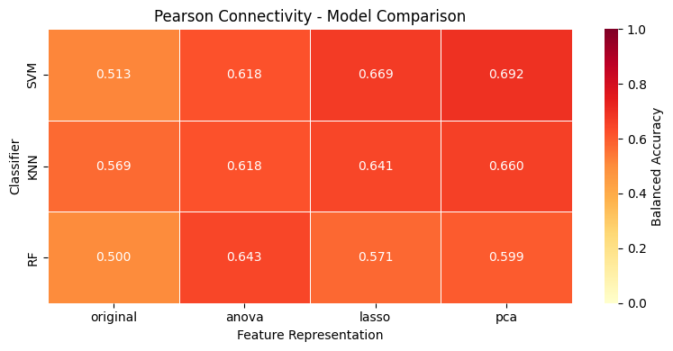
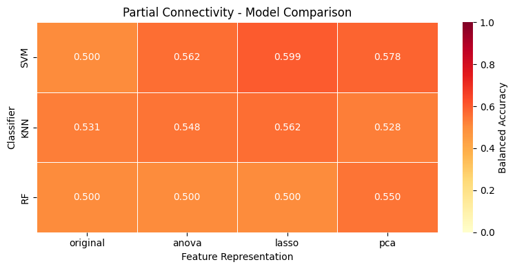

# Notebook 4 Outputs

```text
└── figs
    ├── pearson_model_comparison.png
    └── partial_model_comparison.png
```

This notebook compares **24 machine learning configurations** built by combining:

- **Connectivity type:** Pearson / Partial  
- **Feature representation:** Original / ANOVA / LASSO / PCA  
- **Classifier:** SVM / KNN / RF  

Balanced Accuracy was used as the primary ranking metric because the dataset is imbalanced, and the classifiers showed a bias toward the majority class (MDD).

---

## 1. Best and Worst Performing Models

### Best Performing Models

| Rank | Connectivity | Feature Type | Classifier | Balanced Accuracy | Accuracy | Sensitivity | Specificity | F1-score |
|:---:|:---:|:---:|:---:|:---:|:---:|:---:|:---:|:---:|
| **1** | Pearson | PCA | SVM | **0.69** | 0.58 | 0.43 | 0.95 | 0.59 |
| **2** | Pearson | LASSO | SVM | **0.67** | 0.75 | 0.86 | 0.48 | 0.83 |
| **3** | Pearson | PCA | KNN | **0.66** | 0.74 | 0.84 | 0.48 | 0.82 |

### Worst Performing Models

| Rank | Connectivity | Feature Type | Classifier | Balanced Accuracy | Accuracy | Sensitivity | Specificity | F1-score |
|:---:|:---:|:---:|:---:|:---:|:---:|:---:|:---:|:---:|
| **Worst** | Partial | Original | SVM | **0.50** | 0.71 | 1.00 | 0.00 | 0.83 |
| **Worst** | Partial | Original | RF | **0.50** | 0.71 | 1.00 | 0.00 | 0.83 |
| **Worst** | Partial | ANOVA | RF | **0.50** | 0.71 | 1.00 | 0.00 | 0.83 |

Note: Several configurations collapsed to the majority-class baseline (predicting all subjects as MDD). Since MDD subjects make up exactly ~71% of the dataset (51 out of 72), these dummy predictions yield an accuracy of 0.71 but a balanced accuracy of exactly 0.50.

---

## 2. Model Comparison Heatmaps

<table>
<tr>
<td valign="top">

### Pearson Connectivity



</td>
<td valign="top">

### Partial Connectivity



</td>
</tr>
</table>

These heatmaps show the Balanced Accuracy of all **12 Pearson-based models** and **12 Partial-based models**.  

---

## 3. Overall Effect of Connectivity, Feature Type, and Classifier

<table>
<tr>
<td valign="top">

### Connectivity

| Connectivity | Mean Balanced Accuracy |
|:---:|:---:|
| Pearson | 0.607726 |
| Partial | 0.538165 |

</td>
<td valign="top">

### Feature Type

| Feature Type | Mean Balanced Accuracy |
|:---:|:---:|
| PCA | 0.601307 |
| LASSO | 0.590570 |
| ANOVA | 0.581232 |
| Original | 0.518674 |

</td>
<td valign="top">

### Classifier

| Classifier | Mean Balanced Accuracy |
|:---:|:---:|
| SVM | 0.591387 |
| KNN | 0.581933 |
| RF | 0.545518 |

</td>
</tr>
</table>

Pearson connectivity performed better than partial connectivity on average.  
Among feature representations, **PCA** and **LASSO** gave the strongest results.  
Among classifiers, **SVM** achieved the best average performance.

---

## Discussion

The classification performance is limited by the characteristics of the dataset.  
The small sample size (**72 participants**), imbalanced class distribution (**51 vs 21 subjects**), and high-dimensional feature space (13,695 connectivity features compared with 72 subjects) increase the risk of overfitting and make reliable classification challenging.

Furthermore, from a clinical perspective, there is a notable trade-off in the top-performing models: while the best model (SVM + PCA) achieves the highest balanced accuracy, it sacrifices Sensitivity (0.43). In contrast, the second-best model (SVM + LASSO) offers a much stronger Sensitivity (0.86), making it potentially more valuable for medical screening where missing a depressed patient carries a higher risk.
